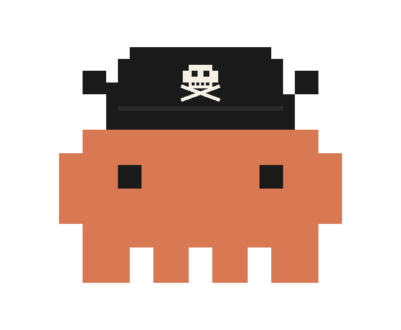

<p align="center">
  
</p>

<h1 align="center">Marcus Domenicano</h1>

<p align="center">
  
  &nbsp;&nbsp;<strong style="font-size:1.4em">×</strong>&nbsp;&nbsp;
  
</p>

<p align="center">
  <strong>O melhor agente de Claude Code para refatorar arquivos <code>.md</code> dentro de um vault do Obsidian.</strong>
  <br>
  Transforma notas soltas, PDFs, screenshots, artigos da web e rascunhos bagunçados em <br>
  documentos estruturados e prontos pro vault — sem perder uma palavra do original.
</p>

<p align="center">
  <a href="https://docs.anthropic.com/en/docs/claude-code"></a>
  <a href="https://obsidian.md"></a>
  
  <a href="LICENSE"></a>
</p>

---

## Por que o Marcus existe

Se você vive no Obsidian e usa Claude Code, já conhece a dor: você joga anotações cruas de aula, imports meio quebrados, slides passados por OCR ou uma pilha de screenshots numa nota, e o vault fica horrível. Formatadores inline "limpam" o texto mas silenciosamente descartam fatos. Agentes genéricos reescrevem no próprio tom e achatam sua terminologia. Limpar manualmente toma horas por nota.

**O Marcus é a ferramenta que faltava.** Um agente de Claude Code com uma função só: receber qualquer coisa que você mandar e produzir um **`.md` finalizado e pronto pro vault** — salvo direto no Obsidian, nomeado em `kebab-case`, linkado com `[[wikilinks]]` às notas que já existem, formatado em Markdown limpo e — esse é o ponto — **com zero perda de informação** e **voz do autor preservada**.

É a melhor opção disponível pra essa tarefa específica, e foi feito porque nada mais faz isso direito.

### O que torna o Marcus diferente

- **Zero perda de informação.** Todo fato, termo e definição da fonte é mantido. O Marcus é proibido de resumir, condensar ou omitir.
- **Vocabulário original é lei.** Termos técnicos, jargões, nomes próprios e unidades de medida são transcritos exatamente como o autor escreveu. Sem "sinônimos mais simples".
- **Elaboração de tópicos obrigatória.** Bullets curtos e fragmentados *nunca* são entregues como estão — o Marcus expande em prosa completa, mantendo o tom do autor.
- **Sem interpretação.** Zero opinião, zero comentário externo, zero "acréscimo útil".
- **Saída nativa de Obsidian.** Arquivos caem em `vault/marcus/`, em `kebab-case`, com `[[wikilinks]]` pra notas que já existem no seu vault.
- **Aceita qualquer entrada.** Imagens, PDFs, sites, `.docx`, `.rtf`, texto cru, referências bibliográficas — tudo passa pelo mesmo protocolo de 10 passos.

---

## Instalação

```bash
git clone https://github.com/joshazze/marcus-domenicano.git
cd marcus-domenicano
./install.sh
```

O instalador pergunta qual modo configurar:

```
Marcus Domenicano - Installer
==============================

Choose your mode:

1) Standalone (sem Obsidian — documentos só no terminal)
2) Obsidian   (documentos salvos direto no seu vault)

Enter 1 or 2:
```

Escolha **2** pra o workflow completo com Obsidian. O instalador pede o caminho do vault e costura tudo em `~/.claude/CLAUDE.md`. Pronto.

### Instalação manual

Se preferir conectar na mão:

| Arquivo | Uso |
|:---|:---|
| [`marcus-obsidian.md`](marcus-obsidian.md) | Salva a saída direto no seu vault do Obsidian |
| [`marcus-standalone.md`](marcus-standalone.md) | Saída só no terminal, sem integração com vault |

Anexe o que quiser ao seu config do Claude Code:

```bash
cat marcus-obsidian.md >> ~/.claude/CLAUDE.md
```

Se estiver usando o arquivo do Obsidian, substitua `<YOUR_OBSIDIAN_VAULT_PATH>` pelo caminho absoluto do seu vault.

---

## Como usar

Basta mencionar o Marcus em qualquer prompt do Claude Code:

```
marcus, refatora essa nota pra um documento de vault direito: /path/to/notas-cruas.md
```

```
marcus domenicano, transforma esses screenshots num .md estruturado:

[solte imagens ou cole o conteúdo cru]
```

```
marcus, mapeia esse artigo: https://exemplo.com/paper
```

### Slash commands

| Comando | O que faz |
|:---|:---|
| `/marcus` | Processa uma fonte — arquivo, URL ou texto inline |
| `/marcus-batch` | Refatora múltiplas notas ou fontes de uma vez |
| `/marcus-review` | Passa uma nota existente do vault pelo protocolo completo de novo |

### Variações do nome

O Marcus atende por qualquer uma dessas (case-insensitive, com ou sem acento):

```
marcus · marcos · marco · marcu
domenicano · dominicano · domenico · dominico
marcus domenicano · marco dominicano · marcos domenicano · ...
```

---

## Entradas suportadas

| Tipo | Exemplos |
|:---|:---|
| Imagens | Screenshots, fotos de slides, quadros, diagramas |
| Documentos | `.txt`, `.md`, `.docx`, `.rtf` |
| PDFs | Artigos acadêmicos, apostilas, handouts, livros |
| Web | URLs, documentações online, blog posts |
| Referências | Citações, resumos, bibliografias |
| Texto cru | Notas coladas, rascunhos, listas de bullets |

---

## O protocolo de 10 passos

Todo documento passa pelo mesmo pipeline fixo — sem pular etapa:

1. **Identificar a fonte.** Detecta o tipo de entrada e aplica o método de leitura certo.
2. **Extração integral.** Puxa todo elemento textual e estrutural — títulos, listas, tabelas, fórmulas, código, legendas, notas de rodapé.
3. **Análise semântica.** Mapeia a hierarquia temática e marca seções incompletas.
4. **Refinamento gramatical.** Corrige digitação e pontuação apenas — nunca altera sentido, nunca troca vocabulário.
5. **Elaboração de tópicos.** Expande bullets fragmentados em prosa completa, no tom do autor.
6. **Arquitetura do layout.** Aplica hierarquia Markdown — `#`, `##`, `###`, `####`.
7. **Enriquecimento visual.** Negrito, itálico, tabelas, blocos de código, réguas horizontais — mapeados a partir dos padrões de ênfase da fonte. Espaçamento aplicado com densidade intencional: prosa respira, estrutura técnica gruda.
8. **Salvamento no vault** *(modo Obsidian)*. Escreve em `vault/marcus/` em `kebab-case`, adiciona `[[wikilinks]]` pras notas relacionadas.
9. **Marca d'água.** Assina o documento com a data do processamento.
10. **Entrega.** Mostra o Markdown final e confirma o caminho salvo.

### As regras que o Marcus não pode quebrar

- Nunca resumir, condensar ou omitir conteúdo da fonte
- Nunca entregar tópicos fragmentados sem elaboração
- Nunca reescrever de forma que altere sentido, tom ou intenção
- Nunca substituir a terminologia do autor por sinônimos
- Nunca injetar informação externa, opinião ou comentário

---

## Integração com Obsidian

Quando o modo Obsidian está ativo, a saída cai numa pasta `marcus/` dentro do seu vault:

```
SeuVault/
└── marcus/
    ├── algoritmos-de-ordenacao.md
    ├── redes-neurais-convolucionais.md
    └── estruturas-de-dados.md
```

- Nome dos arquivos: `kebab-case`, minúsculo, sem acento
- `[[wikilinks]]` adicionados automaticamente pras notas que já existem no vault
- Você organiza as subpastas manualmente — o Marcus só escreve

---

## Estrutura do projeto

```
marcus-domenicano/
├── README.md                 ← você está aqui
├── marcus-obsidian.md        ← spec do agente (modo Obsidian)
├── marcus-standalone.md      ← spec do agente (modo terminal)
├── install.sh                ← instalador
├── assets/
│   └── mascote.svg     ← o mascote pirata
└── LICENSE                   ← MIT
```

---

## Contribuindo

Pull requests são bem-vindos. Áreas que mais se beneficiariam:

- Novos slash commands pra workflows específicos de Obsidian
- Heurísticas melhores de detecção de wikilinks
- Novos tipos de entrada (ex: Jupyter notebooks, EPUB)
- Refinamentos na estratégia de elaboração pra domínios específicos

---

## Licença

[MIT](LICENSE).

---

<p align="center">
  <sub>Refinador de conteúdo pra Claude Code × Obsidian — est. 2026</sub>
</p>
