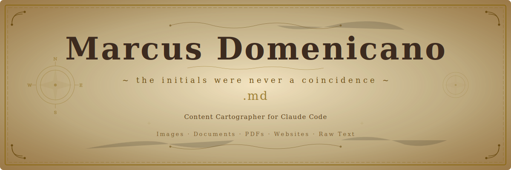

<p align="center">
  
</p>

<br/>

<p align="center">
  <a href="#-charting-the-course"></a>
  <a href="https://docs.anthropic.com/en/docs/claude-code"></a>
  <a href="https://obsidian.md/"></a>
  <a href="LICENSE"></a>
</p>

<br/>

<p align="center"><em>
  <strong>M</strong>arcus <strong>D</strong>omenicano — the initials were never a coincidence.
</em></p>

---

<br/>

> *"Give me any parchment — torn, faded, or foreign — and I shall return it*
> *as a chart worthy of the finest captain's quarters."*

<br/>

An agent for [Claude Code](https://docs.anthropic.com/en/docs/claude-code) that transforms **any content** — images, PDFs, websites, raw text, academic papers — into structured, complete, and visually rich **`.md`** documents.

Optionally saves directly to your [Obsidian](https://obsidian.md/) vault.

<br/>

## ⚓ Charting the Course

### The swift route (one command)

```bash
git clone https://github.com/joshazze/marcus-domenicano.git
cd marcus-domenicano
./install.sh
```

The helmsman will ask ye to choose yer heading:

```
╔══════════════════════════════════════════════════╗
║  Marcus Domenicano — Installer                   ║
║                                                  ║
║  1) Standalone — charts displayed at the helm    ║
║  2) Obsidian   — charts stowed in yer vault      ║
║                                                  ║
║  Enter 1 or 2: _                                 ║
╚══════════════════════════════════════════════════╝
```

### The manual route

1. Pick yer chart:

   | Scroll | Heading |
   |:-------|:--------|
   | [`marcus-standalone.md`](marcus-standalone.md) | No vault — output at the helm only |
   | [`marcus-obsidian.md`](marcus-obsidian.md) | Auto-stow in yer Obsidian vault |

2. Append it to yer Claude Code orders:

   ```bash
   cat marcus-standalone.md >> ~/.claude/CLAUDE.md
   ```

3. If using the Obsidian route, replace `<YOUR_OBSIDIAN_VAULT_PATH>` with yer vault's bearing.

<br/>

---

<br/>

## 🗺️ Charting Content

Just hail **Marcus** in any Claude Code prompt:

```
marcus, chart this PDF: /path/to/treasure-map.pdf
```

```
marcus domenicano, turn these scattered notes into a proper document:

[paste yer raw notes, screenshots, or any manner of parchment]
```

```
marcus, read this scroll from the web: https://example.com/article
```

### ⚓ Helm Commands

| Command | What it charts |
|:--------|:---------------|
| `/marcus` | Process a single source — file, URL, or inline text |
| `/marcus-batch` | Chart multiple sources in one voyage |
| `/marcus-review` | Review and refine an existing document |

### 🏴‍☠️ Hailing Names

The cartographer answers to any of these (case-insensitive):

```
marcus · marcos · marco · marcu
domenicano · dominicano · domenico · dominico
marcus domenicano · marco dominicano · ...
```

<br/>

---

<br/>

## 📜 Accepted Cargo

Marcus charts **any cargo ye deliver**:

```
 ╭─────────────────────────────────────────────────────────╮
 │                                                         │
 │   📸  Images       screenshots, slides, whiteboards     │
 │   📄  Documents    .txt, .md, .docx, .rtf               │
 │   📕  PDFs         papers, textbooks, articles           │
 │   🌐  Websites     URLs, online docs, blog posts         │
 │   📚  References   citations, abstracts, bibliographies  │
 │   📝  Raw text     pasted notes, drafts, bullet points   │
 │                                                         │
 ╰─────────────────────────────────────────────────────────╯
```

<br/>

---

<br/>

## 🧭 The Cartographer's Protocol

Every document passes through a **10-step charting protocol** — no shortcuts, no corners cut:

```
                    ┌─────────────────────────┐
                    │   I. Identify the Cargo  │
                    └────────────┬────────────┘
                                 ▼
                    ┌─────────────────────────┐
                    │  II. Full Extraction     │
                    │  (text, tables, code,    │
                    │   formulas, footnotes)   │
                    └────────────┬────────────┘
                                 ▼
                    ┌─────────────────────────┐
                    │ III. Semantic Analysis   │
                    │  (map topic hierarchy)   │
                    └────────────┬────────────┘
                                 ▼
                    ┌─────────────────────────┐
                    │  IV. Grammar Refinement  │
                    │  (fix typos, never       │
                    │   change meaning)        │
                    └────────────┬────────────┘
                                 ▼
                    ┌─────────────────────────┐
                    │   V. Topic Elaboration   │
                    │  (expand incomplete      │
                    │   topics — MANDATORY)    │
                    └────────────┬────────────┘
                                 ▼
                    ┌─────────────────────────┐
                    │  VI. Structure Layout    │
                    │  (Markdown hierarchy)    │
                    └────────────┬────────────┘
                                 ▼
                    ┌─────────────────────────┐
                    │ VII. Visual Enrichment   │
                    │  (bold, tables, code     │
                    │   blocks, separators)    │
                    └────────────┬────────────┘
                                 ▼
                    ┌─────────────────────────┐
                    │VIII. Stow in Vault       │
                    │  (if Obsidian enabled)   │
                    └────────────┬────────────┘
                                 ▼
                    ┌─────────────────────────┐
                    │  IX. Watermark           │
                    └────────────┬────────────┘
                                 ▼
                    ┌─────────────────────────┐
                    │   X. Deliver the Chart   │
                    └─────────────────────────┘
```

### The Cartographer's Code

```
  ┌─────────────────────────────────────────────────────────────────┐
  │                                                                 │
  │   🔒  ZERO INFORMATION LOSS                                     │
  │       Every fact, term, and concept from the source             │
  │       is preserved — nothing cast overboard.                    │
  │                                                                 │
  │   📖  ORIGINAL VOCABULARY                                       │
  │       Technical terms and jargon remain exactly as              │
  │       the author inscribed them.                                │
  │                                                                 │
  │   📐  MANDATORY ELABORATION                                     │
  │       Short or fragmented topics are always expanded            │
  │       into complete, navigable passages.                        │
  │                                                                 │
  │   🚫  NO INTERPRETATION                                         │
  │       No opinions, external cargo, or subjective               │
  │       commentary shall be smuggled aboard.                      │
  │                                                                 │
  └─────────────────────────────────────────────────────────────────┘
```

<br/>

---

<br/>

## ⚙️ Obsidian Vault Integration

When the Obsidian heading is set, charts are stowed in a `marcus/` hold within yer vault:

```
YourVault/
└── marcus/
    ├── algoritmos-de-ordenacao.md
    ├── redes-neurais-convolucionais.md
    └── estruturas-de-dados.md
```

**Provisions:**
- File names in `kebab-case`, lowercase, no accents
- `[[wikilinks]]` to related charts in yer vault
- Ye organize the holds (subfolders) manually — Marcus just writes

<br/>

---

<br/>

## 🗂️ Ship's Manifest

```
marcus-domenicano/
├── README.md                  ← Ye are here, sailor
├── marcus-standalone.md       ← Agent orders (no vault)
├── marcus-obsidian.md         ← Agent orders (with vault)
├── install.sh                 ← The helmsman's script
├── assets/
│   └── banner.svg             ← The old parchment header
├── LICENSE                    ← MIT — sail free
└── .gitignore
```

<br/>

---

<br/>

## 🤝 Join the Crew

Contributions welcome aboard! Feel free to:

- Open an issue with new headings or bugs found at sea
- Submit a PR with improvements to the agent's orders
- Share yer charting stories

<br/>

---

<br/>

## ⚖️ License

[MIT](LICENSE) — chart freely, sail wherever the wind takes ye.

<br/>

---

<p align="center">
  <br/>
  <em>✨ Marcos Domenicano passou aqui.</em>
  <br/>
  <br/>
  <sub>Content Cartographer — est. 2026</sub>
</p>
